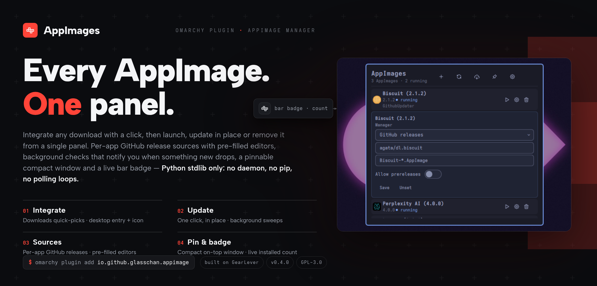

# AppImage for Omarchy



[](https://github.com/glasschan/appimage-for-omarchy/actions/workflows/ci.yml)

Manage AppImages from the Omarchy bar: integrate new ones into your app
menu, see what is installed (and running), launch, update, and remove
them — all in a native Quickshell panel. No daemon, no extra runtime: the
panel is plain QML and the backend is a Python-stdlib CLI that runs only
when an action needs it.

Backend logic is derived from
[GearLever](https://github.com/mijorus/gearlever) (GPL-3.0, mijorus), so
this plugin is licensed under **GPL-3.0** as well — see [LICENSE](LICENSE).
UI icons are from [tabler-icons](https://github.com/tabler/tabler-icons)
(MIT, Paweł Kuna) — see [icons/LICENSE-TABLER.md](icons/LICENSE-TABLER.md).

The panel header is a row of icon-only buttons with tooltips —
Integrate, Refresh, Check updates, Pin, Settings. Pin toggles the panel
between the full-screen overlay and a compact floating window
(session-only, never persisted). When updates are pending, the bar
badge turns urgent and counts them.

Errors are never silent: a hung backend or invalid JSON surfaces as a
dismissible banner in the panel, and a missing `python3` swaps the panel
body for an authorized-install card (see *Install → Python dependency*).
Status messages auto-clear after 5 s; errors stay until dismissed. A
backend call that overruns its watchdog reports a timeout — never a
misleading "python3 missing" hint.

## Requirements

- `python3` (the backend is standard-library only) — present on a normal
  Omarchy install. If it is missing, the panel offers a one-click,
  terminal-authorized install (see below); nothing is ever installed
  without that explicit okay.
- `notify-send` (libnotify) for the background-check desktop notification —
  present on Omarchy; a missing binary just means no notification, never
  a failure.
- Nothing else is required: `unsquashfs`/`bsdtar` (optional fallbacks for
  exotic squashfs compressions), `zstd` (zstd AppImages on Python < 3.14),
  `ps` and `update-desktop-database` are best-effort and their absence is
  never an error (see [backend/CONTRACT.md](backend/CONTRACT.md)). The
  AppImage is never executed to read its metadata.
- AppImage detection accepts the type-1/type-2 magic bytes; magicless
  type-2 builds (modern images that omit the optional `AI\x02` magic) are
  still detected via the ELF header plus a squashfs magic at the
  section-header-table offset.

Security posture (v0.4.2, from a marketplace security review): all
backend egress is https-only with an SSRF guard (public addresses only,
DNS-rebinding-safe dialing, validated redirects), hard byte caps and
absolute whole-operation deadlines on responses; downloaded updates are
installed only after verification against a mandatory cryptographic
digest (GitHub sha256 asset digest, zsync SHA-1 control-file line) —
sources that expose no digest refuse to install; the trust boundaries
cannot be disabled from the environment; installs are atomic (a planted
symlink at a destination is replaced, not written through), uninstalls
only remove paths provably bound to the app, extraction is quota-limited
and symlink-contained, and subprocess output is size-capped on the
producer side. Details in
[backend/CONTRACT.md](backend/CONTRACT.md) ("Security model").

## Install

Everything happens through Omarchy itself — the plugin ships no install
scripts and has no manual setup steps:

```sh
omarchy plugin add https://github.com/glasschan/appimage-for-omarchy --enable
```

Update and removal go through the shell too:

```sh
omarchy plugin update io.github.glasschan.appimage   # then: omarchy restart shell
omarchy plugin remove io.github.glasschan.appimage
```

### Python dependency (authorized in the panel)

The backend needs `python3` — standard library only, no pip packages. On
the rare Omarchy install without it, the panel detects that, and its body
is replaced by an explanation plus an **Install Python** button. Pressing
the button is the authorization: it opens a floating Omarchy terminal
presenting the exact command it will run (`omarchy pkg add python`), which
you watch — and can cancel — like any terminal install. The panel polls
the outcome and picks up automatically: success loads your AppImages,
a cancel or failure says so.

For development, validate and load straight from a checkout:

```sh
omarchy plugin validate "$PWD"
omarchy plugin enable io.github.glasschan.appimage
omarchy restart shell
```

Then click the bar button, or:

```sh
omarchy-shell shell summon io.github.glasschan.appimage '{}'
```

## Backend CLI

The QML layer talks to `backend/main.py` over a stable JSON contract
(see [backend/CONTRACT.md](backend/CONTRACT.md)):

```sh
python3 backend/main.py --list-installed --json
python3 backend/main.py --integrate /path/to/App.AppImage --yes --json
python3 backend/main.py --remove <desktop-id> --yes --json
python3 backend/main.py --list-updates --json
python3 backend/main.py --update <desktop-id> --yes --json
python3 backend/main.py --set-update-source <desktop-id> --manager StaticFileUpdater url=https://example.com/app.AppImage --json
python3 backend/main.py --get-update-source <desktop-id> --json
python3 backend/main.py --list-update-managers --json
python3 backend/main.py --fetch-updates --json
python3 backend/main.py --settings --json
python3 backend/main.py --set-setting update_check_interval_minutes=120 --json
```

With `--json`, stdout is exactly one JSON document (logging goes to
stderr); `--json` requires `--yes` for integrate/remove/update.
`--get-update-source` reads a configured source back — the configured
manager + config, or `no-source` — which is what the panel's source
editor pre-fills from when it opens.

### Update sources

Every app's update source is resolved locally, before any network access:
a custom source from `apps.ini` wins, otherwise the AppImage's embedded
`.upd_info` ELF section is routed (`gh-releases-zsync|…` → GitHub,
`zsync|<url>` → static file; anything else → no source). The five managers
and the `key=value` config keys each accepts:

| Manager | Source | Config keys |
|---|---|---|
| `StaticFileUpdater` | Static URL | `url` |
| `GithubUpdater` | GitHub releases | `repo`, `repo_filename`, `allow_prereleases` |
| `GitlabUpdater` | GitLab releases | `repo_url`, `repo_filename` |
| `CodebergUpdater` | Codeberg releases | `repo`, `repo_filename`, `allow_prereleases` |
| `ForgejoUpdater` | Forgejo releases | `repo_url`, `repo_filename`, `allow_prereleases` |

The panel's source editors pre-fill from the stored config when opened
(read back via `--get-update-source`). `repo_filename` is a glob matched
against the release asset's full name — it must match the asset name
exactly, including dots vs spaces (e.g. `Simplexity.AI-*.AppImage`),
not just a substring; when several assets match, the local architecture
is preferred.

Per-app sources live in
`$XDG_CONFIG_HOME/io.github.glasschan.appimage/apps.ini` (GearLever-
compatible INI); global settings in `…/settings.json` —
`update_check_enabled`, `update_check_interval_minutes` (minimum 15) and
`update_check_delay_minutes`, all writable via `--set-setting`.

## Plugin layout

```
manifest.json     Omarchy plugin manifest (bar-widget + panel + service)
BarWidget.qml     Bar entry: icon + count badge, summons the panel
Panel.qml         Main panel (list, picker, update rows, settings card, states, Escape via PanelKeyCatcher)
Service.qml       Background update checker (scheduled --fetch-updates sweeps)
ThemeIcon.qml     Theme-colored tabler icon (runtime currentColor tint)
lib/Model.js      Shared state store (items cache, counts, busy flags, JSON mapping)
lib/Backend.js    Process wrapper for the backend CLI (watchdog, tolerant JSON parse)
icons/            Bundled tabler SVGs (cube-unfolded, plus, refresh, trash, player-play, settings, arrow-up, cloud-download, pin; MIT) + LICENSE-TABLER.md
backend/          Python stdlib CLI (derived from GearLever)
```

## Releases / versioning

The version lives in `manifest.json`. To cut a release: bump that
version, commit, then push a tag `v<version>` (bump first, tag second).
Pushing the tag triggers [.github/workflows/release.yml](.github/workflows/release.yml),
which verifies the tag matches the manifest version, runs the same tests
as CI, packages the runtime file set into
`io.github.glasschan.appimage-<version>.zip` (it unpacks into a folder
named after the plugin id), and publishes a GitHub Release with
auto-generated notes. Running the workflow manually (`workflow_dispatch`)
is a dry run: the zip is uploaded as a build artifact and nothing is
published.
